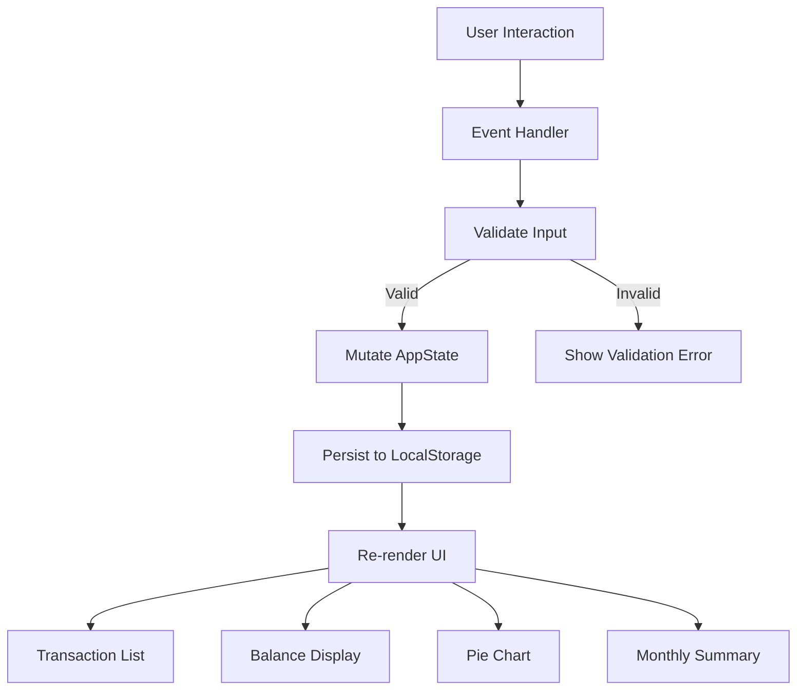

# Design Document: Expense & Budget Visualizer

## Overview

The Expense & Budget Visualizer is a client-side, single-page web application (SPA) built with vanilla HTML, CSS, and JavaScript — no build tooling, no backend. All data is persisted in the browser's Local Storage API.

The app provides:
- A transaction input form with validation
- A scrollable transaction history list
- A live-updating total balance display
- A pie chart (via Chart.js) showing spending by category
- Custom category management
- A monthly summary view
- A dark/light mode toggle with persisted preference

The architecture is intentionally simple: a single `index.html`, a `css/style.css`, and a `js/app.js`. All logic lives in `app.js`, organized into clearly separated modules/functions.

---

## Architecture

The app follows a **unidirectional data flow** pattern:

```
User Action → State Mutation → Storage Sync → UI Re-render
```

There is no framework. State is held in a single in-memory object (`AppState`) that mirrors what is stored in Local Storage. Every user action mutates `AppState`, persists it to Local Storage, then triggers a full or partial UI re-render.



### File Structure

```
index.html
css/
  style.css
js/
  app.js
```

All JavaScript is contained in `app.js`. It is organized into logical sections:
- **State** — in-memory representation of all app data
- **Storage** — read/write helpers for Local Storage
- **Validation** — pure functions for input validation
- **Rendering** — DOM manipulation functions
- **Chart** — Chart.js integration
- **Event Handlers** — wired up on `DOMContentLoaded`

---

## Components and Interfaces

### 1. AppState (in-memory state object)

```js
const AppState = {
  transactions: [],   // Transaction[]
  categories: [],     // string[] (includes defaults + custom)
  theme: 'light',     // 'light' | 'dark'
};
```

### 2. Transaction Object

```js
{
  id: string,         // UUID or timestamp-based unique ID
  name: string,       // item name
  amount: number,     // positive number
  category: string,   // category label
  date: string,       // ISO 8601 date string (YYYY-MM-DD)
}
```

### 3. Form Component

- Fields: `name` (text), `amount` (number), `category` (select)
- Inline validation error display per field
- "Add Custom Category" sub-form (text input + button)
- Submit button triggers `handleAddTransaction()`

### 4. Transaction List Component

- Renders all `AppState.transactions` in reverse-chronological order
- Each row: item name, amount, category, delete button
- Empty state message when list is empty
- Scrollable via CSS (`overflow-y: auto`, max-height)

### 5. Balance Display Component

- Single DOM element at top of page
- Recomputed as `sum of all transaction amounts`
- Updated on every add/delete

### 6. Chart Component (Chart.js)

- Pie chart instance stored in a module-level variable
- Data: aggregated `{ category: totalAmount }` from `AppState.transactions`
- Updated via `chart.data.datasets[0].data = ...` + `chart.update()`
- Placeholder/empty state when no transactions exist

### 7. Monthly Summary Component

- Grouped view: `{ "YYYY-MM": { category: total } }`
- Rendered as a collapsible or tabbed section
- Derived from `AppState.transactions` on demand

### 8. Theme Toggle Component

- Single checkbox or button toggle
- Applies a `data-theme="dark"` attribute to `<html>` element
- CSS variables handle all color switching

### 9. Storage Module

```js
function saveState() { localStorage.setItem('appState', JSON.stringify(AppState)); }
function loadState() { /* reads and parses localStorage, populates AppState */ }
```

---

## Data Models

### Local Storage Schema

All data is stored under a single key `"appState"` as a JSON string:

```json
{
  "transactions": [
    {
      "id": "1714000000000",
      "name": "Coffee",
      "amount": 4.50,
      "category": "Food",
      "date": "2025-04-25"
    }
  ],
  "categories": ["Food", "Transport", "Fun", "Custom1"],
  "theme": "light"
}
```

### Default Categories

The three default categories (`"Food"`, `"Transport"`, `"Fun"`) are always present. Custom categories are appended to the `categories` array and persisted alongside defaults.

### Monthly Summary Derived Structure

Not stored — computed on render from `AppState.transactions`:

```js
// { "2025-04": { Food: 12.50, Transport: 8.00 }, "2025-03": { Fun: 30.00 } }
```

---

## Correctness Properties

*A property is a characteristic or behavior that should hold true across all valid executions of a system — essentially, a formal statement about what the system should do. Properties serve as the bridge between human-readable specifications and machine-verifiable correctness guarantees.*

### Property 1: Transaction addition persists to state and storage

*For any* valid transaction (non-empty name, positive numeric amount, non-empty category), adding it to the app SHALL result in that transaction appearing in the in-memory transaction list and being retrievable from Local Storage with all fields intact.

**Validates: Requirements 1.3, 8.2**

---

### Property 2: Invalid inputs are rejected and state is unchanged

*For any* form submission where the name field is empty or whitespace-only, the amount is zero, negative, or non-numeric, or the category is empty, the transaction SHALL NOT be added and the transaction list SHALL remain identical to its state before the submission.

**Validates: Requirements 1.4, 5.4**

---

### Property 3: Balance invariant — always equals sum of transaction amounts

*For any* collection of transactions (including the empty collection), the balance value computed by the app SHALL always equal the arithmetic sum of all transaction amounts in that collection.

**Validates: Requirements 3.2, 3.3, 3.4**

---

### Property 4: Chart data always matches category aggregation

*For any* collection of transactions, the data values supplied to the pie chart SHALL equal the result of grouping those transactions by category and summing the amounts within each group.

**Validates: Requirements 4.1, 4.2, 4.3**

---

### Property 5: Custom category uniqueness is enforced

*For any* existing categories list and any attempted new category name that already exists in that list (after trimming whitespace), the add operation SHALL be rejected and the categories list SHALL remain unchanged.

**Validates: Requirements 5.5**

---

### Property 6: Custom categories and theme persist across save/load round-trip

*For any* AppState containing custom categories and a theme preference, serializing the state to Local Storage and then deserializing it SHALL produce an equivalent AppState with all custom categories and the theme preference fully restored.

**Validates: Requirements 5.2, 5.3, 7.3, 7.4, 8.2**

---

### Property 7: Monthly summary totals are consistent with transactions

*For any* collection of transactions spanning one or more calendar months, the monthly summary SHALL group transactions by YYYY-MM and the total per category per month SHALL equal the sum of amounts of all transactions in that category for that month.

**Validates: Requirements 6.1, 6.2, 6.3, 6.4**

---

### Property 8: Full AppState serialization round-trip

*For any* valid AppState object (with arbitrary transactions, categories, and theme), serializing it to a JSON string and deserializing it SHALL produce a deeply equal AppState with no data loss or corruption.

**Validates: Requirements 8.1, 8.2**

---

### Property 9: Transaction deletion removes from state and updates balance

*For any* non-empty transaction list, deleting any single transaction SHALL result in that transaction's ID being absent from the transactions array, and the balance SHALL equal the sum of the remaining transactions' amounts.

**Validates: Requirements 2.3, 3.3**

---

## Error Handling

| Scenario | Handling |
|---|---|
| Form submitted with empty fields | Inline validation error shown per field; transaction not added |
| Amount field contains non-numeric or negative value | Validation error; transaction not added |
| Custom category with empty name | Validation error; category not added |
| Custom category already exists | Error message shown; no duplicate added |
| Local Storage unavailable (private browsing, quota exceeded) | Graceful degradation: app works in-memory, shows a warning banner |
| Chart.js fails to load (CDN down) | Chart area shows a fallback text message |
| Malformed JSON in Local Storage | `loadState()` catches parse errors, resets to default empty state |

---

## Testing Strategy

### Unit Tests

Focus on pure functions that have no DOM or storage side effects:

- `calculateBalance(transactions)` — verify sum correctness
- `aggregateByCategory(transactions)` — verify grouping and totals
- `aggregateMonthlySummary(transactions)` — verify month grouping
- `validateTransaction({ name, amount, category })` — verify all validation rules
- `validateCategory(name, existingCategories)` — verify uniqueness and empty checks
- `serializeState(state)` / `deserializeState(json)` — verify round-trip fidelity

### Property-Based Tests

Use a property-based testing library (e.g., **fast-check** for JavaScript) with a minimum of **100 iterations per property**.

Each property test is tagged with:
> **Feature: expense-budget-visualizer, Property {N}: {property_text}**

| Property | Test Description |
|---|---|
| Property 1 | Generate random valid transactions, add each, verify they appear in state and Local Storage with all fields intact |
| Property 2 | Generate invalid inputs (empty/whitespace name, zero/negative/non-numeric amount, empty category), verify all are rejected and state is unchanged |
| Property 3 | Generate random transaction arrays (including empty), verify `calculateBalance` always equals `array.reduce((s,t) => s + t.amount, 0)` |
| Property 4 | Generate random transactions, verify chart data equals `aggregateByCategory` output |
| Property 5 | Generate random category lists and duplicate name attempts, verify uniqueness enforcement and list unchanged |
| Property 6 | Generate random AppState with custom categories and theme, save/load, verify categories and theme are fully restored |
| Property 7 | Generate random transactions across multiple months, verify monthly summary totals match per-month per-category sums |
| Property 8 | Generate random AppState objects, serialize to JSON and deserialize, verify deep equality |
| Property 9 | Generate random non-empty transaction lists, delete a random transaction, verify it is absent and balance equals remaining sum |

### Integration / Smoke Tests

- App loads without errors in Chrome, Firefox, Edge, Safari
- Local Storage read/write works end-to-end in a real browser
- Chart.js renders a pie chart when transactions are present
- Theme toggle applies CSS changes immediately

### Accessibility & Responsive Checks

- Manual verification at 320px, 768px, 1280px, 1920px viewports
- Keyboard navigation through form fields and buttons
- Color contrast ratios checked for both light and dark themes
